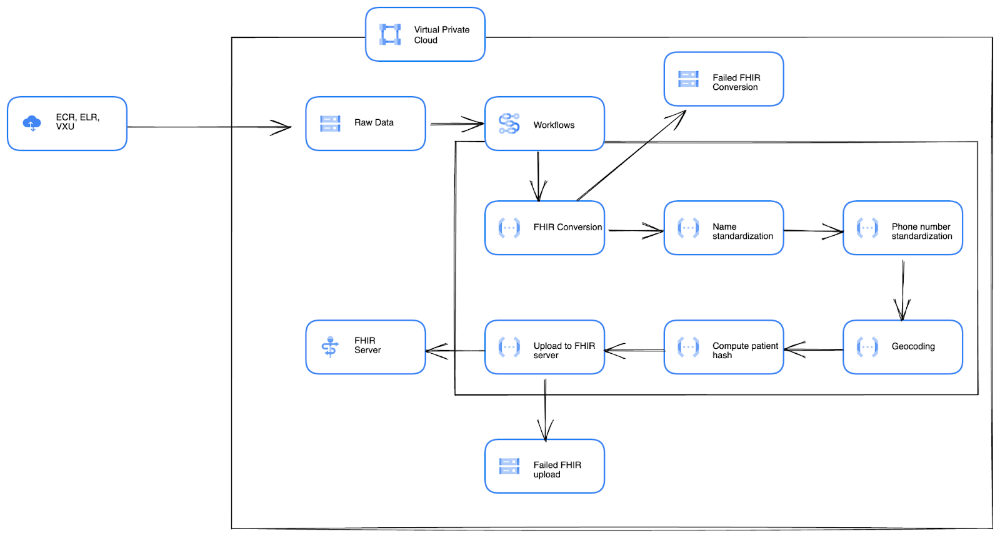

# Getting Started

This is a guide for getting started as user and/or developer with the PRIME PHDI Google Cloud project. You'll find resources on how to setup a local development environment, how we do deployments, and more.

- [Getting Started](#getting-started)
  - [Architecture](#architecture)
    - [Google Workflows](#google-workflows)
    - [Cloud Functions](#cloud-functions)
  - [Local Development Environment](#local-development-environment)
    - [Hardware](#hardware)
    - [Software](#software)
      - [Overview](#overview)
      - [Installation](#installation)
    - [Developing Azure Locally](#developing-azure-locally)
      - [Extensions](#extensions)
      - [Testing](#testing)
      - [Python](#python)
        - [Development Dependencies](#development-dependencies)
        - [Dependencies](#dependencies)
        - [Testing Python](#testing-python)
      - [Pushing to Github](#pushing-to-github)
        - [A Note on Files](#a-note-on-files)
        - [Sensitive Information](#sensitive-information)

## Architecture

We store data on Google Cloud Platform (GCP) in [Cloud Storage buckets](https://cloud.google.com/storage/docs). Data is processed in pipelines, defined as [GCP Workflows](https://cloud.google.com/workflows/docs), that each orchestrate a series of calls to indepent microservices (AKA Building Blocks) that we have implemented using [Cloud Functions](https://cloud.google.com/functions/docs). Each service preforms a single step in a pipeline (e.g patient name standardization) and returns the processed data back to the workflow where it is passed on to the next service via a POST request. The diagram below describes the current version of our ingestion pipeline that converts source HL7v2 and CCDA data to FHIR, preforms some basic standardizations and enrichments, and finally uploads the data to a FHIR server.



### Google Workflows

Since the Building Blocks are designed to be composable users may want to chain serveral together into pipelines. We use [Google Workflows](https://cloud.google.com/workflows/docs) to define processes that require the use of multiple Building Blocks. These workflows are defined using [YAML](https://yaml.org/) configuration files found in the [google-worklows](https://github.com/CDCgov/phdi-google-cloud/tree/main/google-workflows) directory.

The table below summarizes these workflows, their purposes, triggers, inputs, steps, and results:

| Name | Purpose | Trigger | Input | Steps | Result |
| ---- | ------- | ------- | ----- | ----- | ------ |
| ingestion-pipeline | Read source data (HL7v2 and CCDA), convert to FHIR, standardize, and upload to a FHIR server | File creation in bucket via Eventarc trigger | New file name and its bucket | 1. convert-to-fhir<br>2.standardize-patient-names<br>3. standardize-patient-phone-numbers<br>4. geocode-patient-address<br>5. compute-patient-hash<br>6. upload-to-fhir-server | HL7v2 and CCDA messages are read, converted to FHIR, standardized and enriched, and uploaded to a FHIR server as they arrive in Cloud Storage. In the event that the conversion or upload steps fail the data is written to separate buckets along with relevent logging. |

### Cloud Functions
Google Cloud Functions are GCP's version of serverless functions, similar to Lamabda in Amazon Web Services (AWS) and Azure Functions in Mircosoft Azure. Severless function provide a relatively simple way to run services with modest runtime duration, memory, and compute requirements in the cloud. Since they are serverless, GCP abstracts all aspects of the underlying infrastructure allowing us to simply write and excute our Building Blocks without worrying about the computers they run on. The [cloud-functions](https://github.com/CDCgov/phdi-google-cloud/tree/main/cloud-functions) directory contains source code for each of our Cloud Functions. We have chosen to develop the functions in Python because the [PHDI SDK](https://github.com/CDCgov/phdi-sdk) is written in Python and GCP has [strong support and documentation](https://cloud.google.com/functions/docs/concepts/python-runtime) for developing Cloud Functions with Python.

The table below summarizes these functions, their purposes, triggers, inputs, and outputs:

| Name | Language | Purpose | Trigger | Input | Output | Effect |
| ---- | -------- | ------- | ------- | ------| ------ | ------ |
| convert-to-fhir | Python | Convert source HL7v2 or CCDA messages to FHIR. | POST request | file name and bucket name | JSON FHIR bundle or conversion failure message | HL7v2 or CCDA messages are read from a bucket and returned as a JSON FHIR bundle. In the even that the conversion fails the data is written to a separate bucket along with the response of the converter.|
| standarize-patient-names | Python | Ensure all patient names are formatted similarly. | POST request | JSON FHIR bundle | JSON FHIR Bundle | A FHIR bundle is returned with standardized patient names. |
| standardize-patient-phone-numbers | Python | Ensure all patient phone number have the same format. | POST request | JSON FHIR bundle | JSON FHIR bundle | A FHIR bundle is returned with all patient phone numbers in the E.164 standardard international format. |
| geocode-patient-address | Python | Standardize patient addresses and enrich with latitude and longitude. | POST request | JSON FHIR bundle | JSON FHIR bundle | A FHIR bundle is returned with patient addresses in a consistent format that includes latitude and longitude. |
| compute-patient-hash | Python | Generate an identifier for record linkage purposes. | POST request | JSON FHIR bundle | JSON FHIR bundle | A FHIR bundle is returned where every patient resource contains a hash based on their name, date of birth, and address that can be used to link their records. |
| upload-to-fhir-server | Python | Add FHIR resources to a FHIR server. | POST request| JSON FHIR bundle | FHIR server response | All resources in a FHIR bundle are uploaded to a FHIR server. In the event that a resource cannot be uploaded it is written to a separate bucket along with the response from the FHIR server. |  

## Local Development Environment

The instructions below describe how to setup a development environment for local development of Cloud Functions.

### Hardware

Until we have properly containerized our apps, we will need to rely on informal consensus around hardware. Here is a list of machines that are compatible with development:
- Intel Macs
- Apple-Silicon Macs
- Windows-based machines with Windows 10/11 Home or higher. However, as the work moves towards containerization, Windows Pro will be necessary in order to run Docker.

### Software

#### Overview
The team uses VSCode as its IDE, but other options (e.g. IntelliJ, Eclipse, PyCharm, etc.) can be viable as well. The main driver behind using VSCode is that it integrates well with Microsoft Azure, the cloud provider that development on the PHDI project began with originally. The rest of this document will assume that you're using VSCode as your IDE. The project itself is coded primarily in Python.

#### Installation
1. Install the latest version of [VSCode](https://code.visualstudio.com/download) (or use `brew install vscode`).
2. Install [Python 3.9.x](https://www.python.org/downloads/).  As of this writing, this is the highest Python version we currently support.
3. Install [pip](https://pip.pypa.io/en/stable/installation/). This is the Python package manager we use.
4. Install the VSCode [Python](https://marketplace.visualstudio.com/items?itemName=ms-python.python) extension (optional but recommended). 
5. Install the VSCode [HashiCorp Terraform](https://marketplace.visualstudio.com/items?itemName=HashiCorp.terraform) extension (optional but recommended).
 

### Developing Python Google Cloud Functions

At a high level, we follow the guide [here](https://cloud.google.com/functions/docs/how-to) for developing Python runtime Cloud Functions. Please note that this guide also provides documentation for Cloud Functions using other runtimes beyond Python so make sure to read carefully.

#### Cloud Function Directory Structure

All Cloud Functions live in the [cloud-functions](https://github.com/CDCgov/phdi-google-cloud/tree/main/cloud-functions) directory. The tree below shows a generalized example for a generic Cloud Functions called `myfunction`. 

```bash
cloud-functions/
   ├── requirements_dev.txt
   └── upcase_http/
       ├── main.py
       ├── requirements.txt
       └── test_upcase_http.py
```

#### Testing

Before diving into the specifics of working with Python, it's worth covering how testing Azure Functionality in VS Code in general works, which is outlined below.

* As long as you have the Azure Functions extension installed (as described above), then you can either click the `Run -> Debug` button (the one that looks like the sideways triangle with the bug) or press `F5` to run the Function.  
* The second thing you'll need implemented is the Azurite storage extension described above. If you've installed this through the VS Code extension, then you can start the container by clicking one of the three buttons in the bottom-right tray of VS Code, which will saying "Azurite Table Service", "Azurite Queue Service", or "Azurite Blob Service". If you've installed Azurite using npm or Docker, use [the documentation](https://docs.microsoft.com/en-us/azure/storage/common/storage-use-azurite?tabs=npm) to work through how to start the service.  
* To use this container, set your connection string to `UseDevelopmentStorage=true`as detailed [here](https://docs.microsoft.com/en-us/azure/storage/common/storage-use-azurite?tabs=visual-studio).

#### Python

Microsoft maintains a pretty good guide [here](https://docs.microsoft.com/en-us/azure/azure-functions/functions-reference-python?tabs=asgi%2Cazurecli-linux%2Capplication-level) for developing Azure functions with Python. We've followed this guide wherever possible, it's worth a look for reference.

##### Development Dependencies

In your terminal, navigate to the `src/lib/phdi_building_blocks` directory and run `poetry install`
In your terminal, navigate to the `src/lib/FunctionApps` directory and run `pip install -r requirements_dev.txt`

These include:

- [Black](https://black.readthedocs.io/en/stable/) - automatic code formatter that enforces PEP best practices
- [pytest](https://docs.pytest.org/en/6.2.x/) - for easy unit testing
- [flake8](https://flake8.pycqa.org/en/latest/) - for code style enforcement

##### Dependencies

To add a new dependency, add it to `requirements.txt` if it is critical to run the app, and `requirements_dev.txt` if it helps local development. You can manually install these dependencies using `source .venv/bin/activate; pip install -r requirements.txt` or using the built-in F5 action provided by the Azure extension.

Deploying the function app will result in it automatically installing the dependencies in `requirements.txt`.

##### Testing Python

We use [pytest](https://docs.pytest.org/en/6.2.x/) for the purpose of unit testing functions. All functions should have associated pytest tests. Tests live within a `test` directory that is shared between all python-based apps using the same function app.

Files should be named `test_{name}` and each method should begin with `test_` to ensure it is picked up by the Testing tab.

To run tests, go to the `Test` tab and ensure tests can be located. From there you can run necessary automated tests.

Tests that exercise storage blob-related funcitonality should use [Azurite](https://docs.microsoft.com/en-us/azure/storage/common/storage-use-azurite?tabs=visual-studio) , those testing SFTP should use SFTP mocks.

#### Pushing to Github

To get access to push to Github, ask to get maintainer access to the repo for your Github account.

##### A Note on Files

Using the direct VSCode integration generates a number of files, the details of which are outlined in the above link. All files within the `.vscode` folder should be checked in. Double check that these do not contain environment variables or paths that are specific to your machine. Also, very importantly, **DO NOT** check in `local.settings.json` , this will contain sensitive information.

##### Sensitive Information

We use Azure KeyVault for sensitive information, and the "Configuration" properties of each function to store relevant variables. We tie the two together using [Azure KeyVault References](https://docs.microsoft.com/en-us/azure/app-service/app-service-key-vault-references).

You can easily download the environment variable configuration for a given function app using the azure CLI with:

```bash
cd src/FunctionApps/NAME
func azure functionapp fetch-app-settings pitest-python-functionapp --output-file local.settings.json
func settings decrypt
```

You can then further customize this file.

