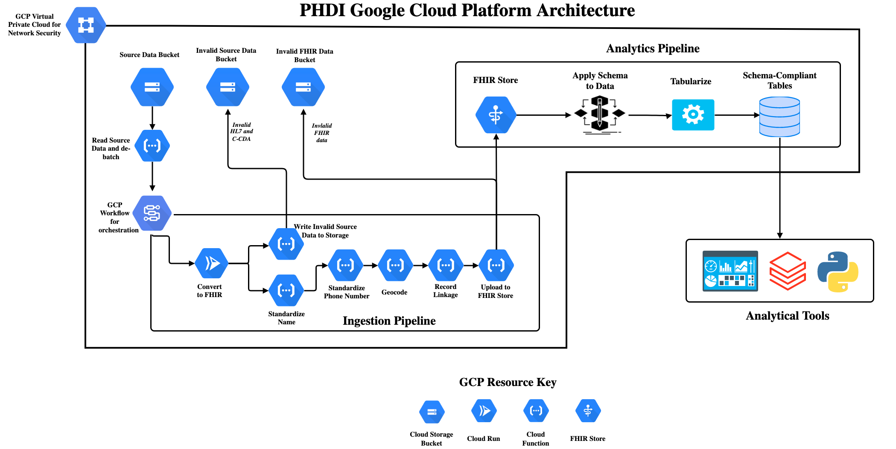

# Getting Started

This is a guide for getting started as a user and/or developer with the PRIME PHDI Google Cloud project. You'll find resources on how these tools are deployed, how to setup a local development environment, and more.

- [Getting Started](#getting-started)
  - [Architecture](#architecture)
    - [Google Workflows](#google-workflows)
    - [Cloud Functions](#cloud-functions)
    - [GCP Project Configuration](#gcp-project-configuration)
  - [Next Steps](#next-steps)

## Architecture

We store data on Google Cloud Platform (GCP) in [Cloud Storage buckets](https://cloud.google.com/storage/docs). Data is processed in pipelines, defined as [Google Workflows](https://cloud.google.com/workflows/docs), that each orchestrate a series of calls to indepent microservices (AKA Building Blocks) that we have implemented using [Cloud Functions](https://cloud.google.com/functions/docs). Each service preforms a single step in a pipeline (e.g patient name standardization) and returns the processed data back to the workflow where it is passed on to the next service via a POST request. The diagram below describes the current version of our ingestion pipeline that converts source HL7v2 and CCDA data to FHIR, preforms some basic standardizations and enrichments, and finally uploads the data to a FHIR server.

### Google Workflows

Since PHDI Building Blocks are designed to be composable users may want to chain several together into pipelines. We use [Google Workflows](https://cloud.google.com/workflows/docs) to define processes that require the use of multiple Building Blocks. These workflows are defined using [YAML](https://yaml.org/) configuration files found in the [google-worklows/](https://github.com/CDCgov/phdi-google-cloud/tree/main/google-workflows) directory.

The table below summarizes the overall workflow, its purpose, triggers, inputs, steps, and results:

| Name | Purpose | Trigger | Input | Steps | Result |
| ---- | ------- | ------- | ----- | ----- | ------ |
| ingestion-pipeline | Read source data (HL7v2 and CCDA), convert to FHIR, standardize, and upload to a FHIR server | File creation in bucket via Eventarc trigger | New file name and its bucket | 1. convert-to-fhir 2.standardize-patient-names 3. standardize-patient-phone-numbers 4. geocode-patient-address 5. compute-patient-hash 6. upload-to-fhir-server | HL7v2 and CCDA messages are read, converted to FHIR, standardized and enriched, and uploaded to a FHIR server as they arrive in Cloud Storage. In the event that the conversion or upload steps fail the data is written to separate buckets along with relevent logging. |

### Cloud Functions
[Cloud Functions](https://cloud.google.com/functions/docs) are GCP's version of serverless functions, similar to Lambda in Amazon Web Services (AWS) and Azure Functions in Mircosoft Azure. Severless functions provide a relatively simple way to run services with modest runtime duration, memory, and compute requirements in the cloud. They are considered serverless because the cloud provider, GCP in the case, abstracts away management of the underlying infrastructure from the user. This allows us to simply write and excute our Building Blocks without worrying about the computers they run on. The [cloud-functions/](https://github.com/CDCgov/phdi-google-cloud/tree/main/cloud-functions) directory contains source code for each of our Cloud Functions. We have chosen to develop the functions in Python because the [PHDI SDK](https://github.com/CDCgov/phdi-sdk) is written in Python and GCP has [strong support and documentation](https://cloud.google.com/functions/docs/concepts/python-runtime) for developing Cloud Functions with Python.

The table below summarizes these functions, their purposes, triggers, inputs, and outputs:

| Name | Language | Purpose | Trigger | Input | Output | Effect |
| ---- | -------- | ------- | ------- | ------| ------ | ------ |
| convert-to-fhir | Python | Convert source HL7v2 or CCDA messages to FHIR. | POST request | file name and bucket name | JSON FHIR bundle or conversion failure message | HL7v2 or CCDA messages are read from a bucket and returned as a JSON FHIR bundle. In the even that the conversion fails the data is written to a separate bucket along with the response of the converter.|
| standardize-patient-names | Python | Ensure all patient names are formatted similarly. | POST request | JSON FHIR bundle | JSON FHIR Bundle | A FHIR bundle is returned with standardized patient names. |
| standardize-patient-phone-numbers | Python | Ensure all patient phone number have the same format. | POST request | JSON FHIR bundle | JSON FHIR bundle | A FHIR bundle is returned with all patient phone numbers in the E.164 standardard international format. |
| geocode-patient-address | Python | Standardize patient addresses and enrich with latitude and longitude. | POST request | JSON FHIR bundle | JSON FHIR bundle | A FHIR bundle is returned with patient addresses in a consistent format that includes latitude and longitude. |
| compute-patient-hash | Python | Generate an identifier for record linkage purposes. | POST request | JSON FHIR bundle | JSON FHIR bundle | A FHIR bundle is returned where every patient resource contains a hash based on their name, date of birth, and address that can be used to link their records. |
| upload-to-fhir-server | Python | Add FHIR resources to a FHIR server. | POST request| JSON FHIR bundle | FHIR server response | All resources in a FHIR bundle are uploaded to a FHIR server. In the event that a resource cannot be uploaded it is written to a separate bucket along with the response from the FHIR server. |  

### GCP Project Configuration

In order for all of the functionality offered in this repository to work properly in GCP some additional [Cloud APIs](https://cloud.google.com/apis) must be enabled. There is no need to make these changes manually as we have provided Terraform coverage to ensure these configurations are made. We are mentioning this here in order to clearly represent effect that deploying the tools in this repository will have on your GCP project. The APIs that must be enabled include:

- [Cloud Functions API](https://cloud.google.com/functions/docs/reference/rest)
- [Workflows API](https://cloud.google.com/workflows/docs/reference/rest)
- [Cloud Healthcare API](https://cloud.google.com/healthcare-api)
- [Cloud Pub/Sub API](https://cloud.google.com/pubsub/docs/reference/rest)
- [Compute Engine API](https://cloud.google.com/compute/docs/reference/rest/v1)
- [Eventarc API](https://cloud.google.com/eventarc/docs/apis)
- [IAM Service Account Credentials API](https://cloud.google.com/iam/docs/reference/credentials/rest)
- [Cloud Build API](https://cloud.google.com/build/docs/api/reference/rest)

## Next Steps
Now that you are familiar with the project you can begin implementation by following our guide [here](implementation-guide.md).

If you would like to set up a local environment for developing Cloud Functions follow the instructions found [here](setup_local_development.md). (This is not necessary to run the Quick Start script)

