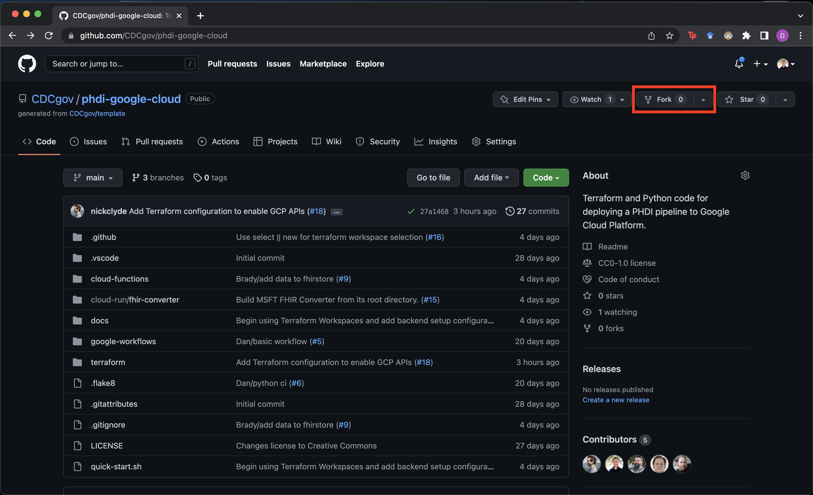
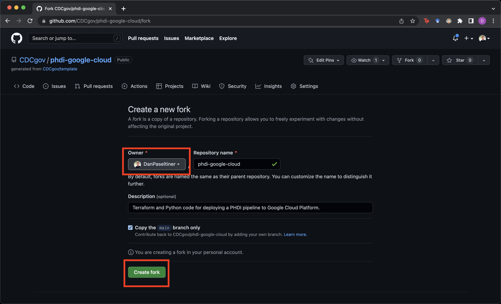
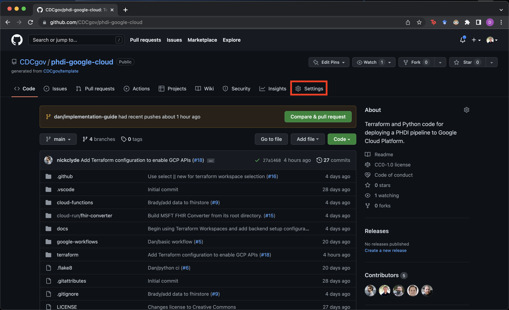
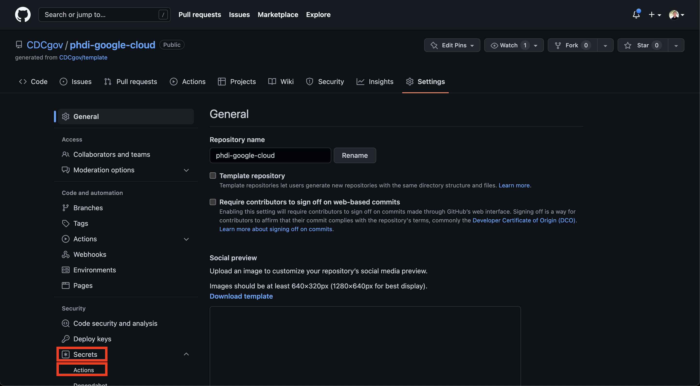
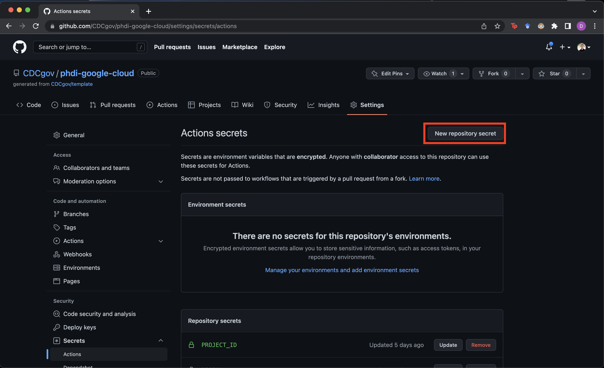
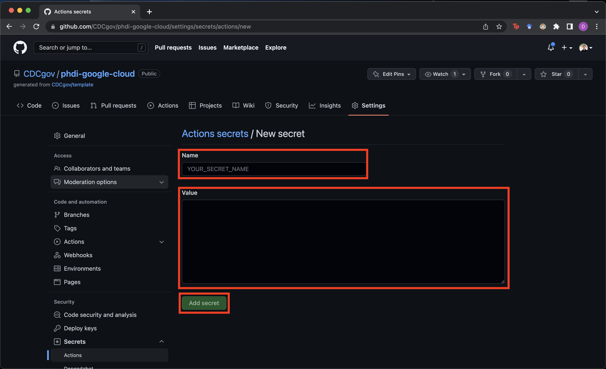

# PHDI Google Cloud Platform Implementation Guide

- [PHDI Google Cloud Platform Implementation Guide](#phdi-google-cloud-platform-implementation-guide)
    - [Introduction](#introduction)
        - [What is PHDI?](#what-is-phdi)
        - [What are Building Blocks?](#what-are-building-blocks)
        - [PHDI Pipelines](#phdi-pipelines)
            - [Ingestion Pipeline](#ingestion-pipeline)
            - [Analytics Pipeline](#analytics-pipeline)
        - [Additional References](#additional-references)
    - [Implementing the PHDI Google Cloud Platform Pipelines](#implementing-the-phdi-google-cloud-platform-pipelines)
        - [Step 1: Prepare Your GCP Environment](#step-1-prepare-your-gcp-environment)
        - [Step 2: Install the Gcloud CLI](#step-2-install-the-gcloud-cli)
        - [Step 3: Fork the PHDI google-cloud-repository](#step-3-fork-the-phdi-google-cloud-respository)
        - [Step 4: Clone the Forked Repository](#step-4-clone-the-forked-repository)
        - [Step 5: Run the Quickstart Script](#step-5-run-the-quickstart-script)
        - [Step 6: Set Repository Secrets](#step-6-set-repository-secrets)
        - [Step 7: Run the Terraform Setup GitHub Workflow](#step-7-run-the-terraform-setup-github-workflow)
        - [Step 8: Run the Deployment GitHub Workflow](#step-8-run-the-deployment-github-workflow)
        - [Step 9: Run End-to-end Functional Tests](#step-9-run-the-end-to-end-functional-tests)
    - [Estimated Costs](#estimated-costs)

## Introduction
This document provides a detailed guide for implementing the PHDI pipelines provided in this repository.

### What is PHDI?
The Public Health Data Infrastructure (PHDI) project is part of the Pandemic-Ready Interoperability Modernization Effort (PRIME), a multi-year collaboration between CDC and the U.S. Digital Service (USDS) to strengthen data quality and information technology systems in state and local health departments. Under the PRIME umbrella the PHDI project seeks to develop tools, often referred to as Building Blocks, that State, Tribal, Local, and Territorial public health agencies (STLTs) can use to better handle the public health data they receive. The purpose of this repository is to implement the Building Blocks provided in the [PHDI library](https://github.com/CDCgov/phdi-sdk) on Google Cloud Platform (GCP). This will allow users to easily implement these Building Blocks in their own GCP environment.

### What are Building Blocks?
PHDI's goal is to provide STLTs with modern tools to solve challenges working with public health data. We refer to each of these tools as a "Building Blocks". Some Building Blocks offer relatively simple functionality, like standardizing patient names, while others perform more complex tasks, including geocoding and standardizing addresses. Importantly, the Building Blocks have been carefully designed with common inputs and outputs making them easily composable.  

### PHDI Pipelines
The composable nature of Building Blocks allows them to be strung together into data pipelines where each Building Block represents a single step in a pipeline. As an example, let's consider a hypothetical case where a STLT would like to improve the quality of their patient address data and ensure that patient names are written consistently. They could solve this problem by using the name standardization and geocoding Building Blocks, mentioned in the previous section, to build a simple pipeline that standardizes patients' names and geocodes their addresses. Non-standardized data would be sent into the pipeline, where it would pass through each of the Building Blocks, and then exit the pipeline with standardized name and address fields. STLTs are welcome to use Building Blocks to create their own custom pipelines. However, because many STLTs are facing similar challenges with their data this repository implements two pipelines, developed by the PHDI team, centered around a GCP FHIR Store. The complete architecture for this system is shown in the diagram below.

#### Ingestion Pipeline
The ingestion pipeline is intended to allow STLTs to easily bring data that is reported to them into their system after performing standardizations and enrichments. Source data can be provided in either Hl7v2 or C-CDA formats allowing this single pipeline to handle the ingestion of ELR, VXU, ADT, and eCR messages. The pipeline is able to handle both data types because the inital step is to convert to FHIR. After this conversion the pipeline is able to handle all reported data the same way by simply processing the FHIR bundles, collections of FHIR resources, that result from the conversion. Once data has be converted to FHIR the following standardizations and enrichments are made:
1. Patient names are standardized.
2. Patient phone numbers are transformed into the ISO E.164 standard international format.
3. Patient addresses are geocoded for standardization and enrichment with latitude and longitude.
4. A hash based on a patient's name, date of birth, and address is computed to facilitate linkage with other records for the same patient.

After the data has been cleaned and enriched it is uploaded to a FHIR Store where it can serve as a single source of truth for all downstream reporting and analytics needs.

#### Analytics Pipeline
The analytics pipeline provides a mechanism for extracting and tabularizing desired data from the FHIR Store. Users define schemas describing the table(s) they would like from the FHIR Store and submit them to the analytics pipeline. The pipeline then interprets the schemas, queries the FHIR for the necessary data, transforms the un-structured FHIR resources into tables, and makes them available for reporting and analysis.

### Additional References
We have only provided a brief overview of PHDI, Building Blocks, and the pipelines we have designed. For additional information please refer to documents linked below.
- [PHDI-google-cloud README](./README.md)
- [PHDI-google-cloud Getting Started Guide](./getting_started.md)

## Implementing the PHDI Google Cloud Platform Pipelines
In this section we describe how a STLT can take this repository and use it to spin up all of the functionality that it offers in their own GCP environment.

### Step 1: Prepare Your GCP Environment
In order to proceed you will need either:
- a GCP account with permissions to create new projects in your organization's GCP environment,
or
- a GCP account with `Owner` access to a project in your organizations’ GCP environment that was created to house the PHDI GCP pipelines, and the name of this project.

If you do not meet either of these criteria contact the owner of your organization's GCP environment.

### Step 2: Install the Gcloud CLI.
The gcloud CLI is a command line tool provided by Google for working with GCP. We will use it to authenticate your local machine with your organization's GCP environment. Follow [this guide](https://cloud.google.com/sdk/docs/install) to install gcloud. After installation run `gcloud auth application-default login` and follow the prompts in your browser to login to GCP.

### Step 3: Fork the phdi-google-cloud Repository
Fork the phdi-google-cloud repository into your organization's, or your personal, GitHub account.
1. Navigate to [https://github.com/CDCgov/phdi-google-cloud](https://github.com/CDCgov/phdi-google-cloud).
2. Click on the `Fork` button in the top right.

3. Select the owner of the forked repository. We recommend that this is an organization and not an individual.
4. Click `Create fork` at the bottom of the page.

### Step 4: Clone the Forked Repository
Clone the forked version of the phdi-google-cloud repository by running `git clone https://github.com/<MY-GITHUB-ORGANIZATION>/phdi-google-cloud.git`. If you do not have `git` installed please follow [this guide](https://github.com/git-guides/install-git) to install it.

### Step 5: Run the Quick Start Script
In this step we will work through GCP's [Workload Identity Federation](https://cloud.google.com/iam/docs/workload-identity-federation) to granted your phdi-google-cloud repo access to deploy the pipelines to your organization's GCP environment. We have provided a script to automate most of this process that we recommend you use. However if you prefer to work through it manually you may follow [this guide](https://github.com/google-github-actions/auth#setup).

From your machine's command line:
1. Navigate to the root directory of the repository you cloned in step 4.
2. Login into GCP by running `gcloud auth application-default login`.
3. Run the quick start script and follow the prompts.
    - [quick-start.sh](../quick-start.sh) for Mac and Linux
    - TODO: WRITE WINDOWS BATCH QUICK START SCRIPT

If you plan to deploy to an existing project in your GCP environment, have the project ID ready and provide it to the quick start script when prompted.

### Step 6: Set Repository Secrets
Set the following secret values in your forked phdi-google-cloud repository:
- `PROJECT_ID` - Specified by the quick start script.
- `SERVICE_ACCOUNT_ID` - Specified by the quick start script.
- `WORKLOAD_IDENTITY_PROVIDER` - Specified by the quick start script.
- `REGION` - Your choice of GCP region.
- `ZONE`- Your choice of GCP zone.

Information about GCP regions and zones is available [here](https://cloud.google.com/compute/docs/regions-zones).

To create a repository secret follow these steps.
1. Navigate to `https://github.com/<MY-GITHUB-ORGANIZATION>/phdi-google-cloud.git` in your browser.
2. Click on `Settings` in the top right.

3. Click on `Secrets` and then `Actions` in the bottom left.

4. Click on `New repository secret`.

5. Fill in `Name` and `Value` fields and then click `Add secret`.

### Step 7: Run the Terraform Setup GitHub Workflow
Now we will run the 

### Step 8: Run the Deployment GitHub Workflow

### Step 9: Run End-to-end Functional Tests
TODO: Design some basic tests and describe how to run them here.

## Estimated Costs
TODO: Conduct cost analysis for the ingestion pipeline.

